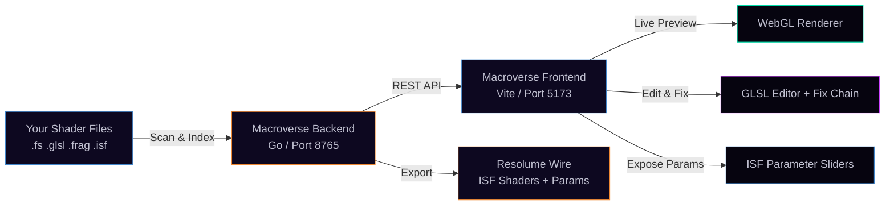

# Macroverse 42 — The Wired Atelier

> *Ride the signal. The wire is not a metaphor.*

A GLSL/ISF shader lab and VJ tool. Two ways in — one binary.

**[Try it live →](https://macroverse.aday.net.au/)** &nbsp;|&nbsp; **[Showcase →](https://showcase.macroverse.aday.net.au/)** &nbsp;|&nbsp; **[Download →](https://github.com/aday1/macroverse.aday.net.au/releases)** &nbsp;|&nbsp; **[Source / Docker →](https://github.com/aday1/macroverse.aday.net.au)**

---

## Two Ways In

### As a standalone VJ tool
Browse, preview, and perform with your entire GLSL/ISF shader collection. Tag, categorise, search. A/B deck with crossfader and mix modes. Stream MJPEG output to OBS, pipe through v4l2loopback as a virtual webcam on Linux. The whole library, live, under your hands.

### As a Resolume Wire pipeline
Load any GLSL/ISF file, check Wire compatibility, expose magic-number literals as parameter sliders, run the shader fix chain (broken glows → fixed in seconds), then push the finished shader straight into Resolume Wire. From raw `.fs` to a working Wire macro with exposed parameters and proper ISF metadata.

```
# Build from source (requires Go 1.21+, Node 20+)
./build.sh          # Linux / Mac
build.bat           # Windows
# then open http://localhost:8765
```

**Pre-built binaries for Windows, Linux, and Mac (amd64/arm64):** [Releases](https://github.com/aday1/macroverse.aday.net.au/releases)

---

## Cloud edition vs desktop

| | **Cloud** (macroverse.aday.net.au) | **Desktop / self-host** |
|---|---|---|
| Shader lab, Preview, Code, Split, VJ, Gallery | Yes | Yes |
| Gig sessions, audience QR, co-VJ WebSocket | Yes | Yes |
| MIDI / OSC / FFT in browser | Yes | Yes |
| Server library writes | No — IndexedDB in this browser | Yes — disk + optional git commit |
| Pipeline / Wire Hub tabs | Hidden | Yes |
| Spout / NDI / MacroCam MJPEG | No | Yes |
| Cursor agent, Explorer, Notepad, Scan, Update | Hidden | Yes |
| Ollama / Cursor Refactor / Vibe toolbar | Limited on cloud | Full |

Export browser-local edits from **Settings → Browser-local edits** on cloud. Run the Go binary locally or self-host with Docker for the full Wire pipeline.

**LAN bridge agent** (`macroverse-bridge-agent/`): optional Node service on a Pi or venue LAN machine. Bridges **Ableton Link** clock (BPM/beat/bar) into the cloud WebSocket session; OSC LAN relay is planned. See [docs/BRIDGE.md](docs/BRIDGE.md).

---

## What It Does



One Go binary. No Docker, no Node runtime, no external database. Drop it next to your shader folder and open `localhost:8765`.

---

## Expose Parameters

Turn raw GLSL literals into live ISF parameter sliders — the core feature for Wire integration.

- **Expose (instant)** — click Expose in the toolbar. Regex-based literal detection, zero tokens, zero latency.
- **AI Expose** — deeper analysis with Ollama or Cursor for complex shaders.
- Exposed parameters are written directly into the ISF JSON block and become controllable in Resolume Wire's universe.

```glsl
// Before: magic literals scattered through your shader
float speed = 2.5;
vec3 color = vec3(0.4, 0.8, 1.0);

// After: exposed as ISF sliders, controllable from Wire
// INPUTS: speed (float, 0.1–10.0), colorR/G/B (float, 0.0–1.0)
```

---

## Shader Fix Chain

When a shader fails to compile, fixes run in order — stop at the first success:

1. **Local regex fix** — free, instant. Handles precision qualifiers, missing semicolons, WebGL 1 incompatibilities, `#version` stripping.
2. **Ollama** — free local LLM. `ollama pull deepseek-coder-v2:16b` and configure in Settings.
3. **Cursor agent** — cloud tokens. Requires API key in Settings > LLM Provider Chain.

The chain is configurable: reorder, enable/disable each provider, select model per provider.

---

## Command Palette

Every action in the app is registered as a command and runnable from a Slack/Discord-style palette.

- **Open** with `Ctrl+K` / `Cmd+K`, or `/` when no input is focused
- Categories: Editor, Parameters, Wire, External, View, App, Display effects, Panels
- Up/Down to move, Enter to run, Esc to close
- Mobile-friendly: the same palette is reachable via the `>_` button in the top app bar and the **Commands >_** button on the More sheet

---

## Top App Bar & Mobile UI

A persistent header on every device:

- **Logo** opens Settings
- **Shader name** with a copper "dirty" dot when there are unsaved changes
- **View dropdown** mirrors the view tabs (handy when the strip is hidden on phones)
- **Last build** badge: build date + git short-SHA from `/api/version` (hidden under 900px)
- **Save / Palette / Hamburger** buttons on the right

On phones (< 640px) a five-tab bottom bar appears:

| Tab | What it does |
|---|---|
| Library | Toggle the left dock (shader index) |
| Preview | Switch to Preview view (or Split if currently in Code) |
| Code | Switch to Code view, close side docks |
| Params | Toggle the right dock (parameter sliders) |
| More | Open a sheet of secondary actions: VJ deck, Gallery, Pipeline, Wire Hub, Split, Commands, Settings, Help, Paths, Rescan |

A **Mobile / Desktop** toggle in the status bar force-applies the mobile CSS on any device; preference persists in localStorage.

---

## Pipeline View & Wire Hub View

Two extra view tabs alongside Preview / Code / Split / VJ / Gallery:

- **Pipeline** — full signal-flow diagram from your shader sources through the Go backend to the WebGL renderer, ISF JSON, and Resolume Wire export. Click nodes to jump into the relevant panel.
- **Wire Hub** — Wire-side controls: Check ISF Wire, Clipboard to Wire, push to Wire, batch export. Use the diagram view tab to see all 5 FX topologies (feedback, beat-sync, glitch, geometric, colour) at once.

---

## Update Button (in-app rebuild)

The toolbar **Update** button auto-pulls and rebuilds from GitHub.

- Five seconds after launch the app silently runs `git fetch` + `git log HEAD..origin/HEAD`
- If the remote is ahead, the button turns amber and shows `Update (N)`
- Clicking opens a modal listing the incoming commits; **Apply & Restart** writes a temp script that runs `git pull origin` + `build.bat` (or `build.sh`) + relaunches the new binary, then exits the current process so Windows can overwrite the running exe
- Gracefully no-ops outside a git repo

Backend endpoints: `GET /api/update/check`, `POST /api/update/apply`.

---

## Display Effects

All toggleable from the status bar or via the command palette:

- **Scanlines** — horizontal scan-line overlay on the preview
- **Vignette** — darkened corners on the preview
- **CRT** — phosphor glow on the code editor
- **Full Screen** — status-bar button or `F11`

A light-theme preset is available alongside the default Wired Atelier dark palette.

---

## Roliblock (multi-device, BLE / USB)

N simultaneous Roli Lightpad blocks, each with independent MIDI, handshake, LED buffer, and per-device settings.

- **USB-first auto-rig** — Request MIDI auto-detects Roli USB input/output pairs, enables them, and defaults to shared master-output mirroring
- **Per-device deck assignment** — shared / deckA / deckB / auto. Shared is the default; Deck A/B is available when you want independent deck pads
- **Per-deck XY** — in Independent mode, one enabled block can drive Deck A XY and a second enabled block can drive Deck B XY. Shared output mode drives the global VJ mouse from every enabled block.
- **BLE MIDI** — Web Bluetooth pairing; Device A can be BLE while Device B is USB. 250ms handshake / 80ms LED stream on BLE; 150ms / 50ms on USB. SysEx chunked for BLE MTU.
- **LED filters** — per-device contrast, brightness, saturation, gamma, grayscale, invert, posterize, channel isolation
- **LED drawing modes** — Shared output / Mirror (default), independent per-deck LEDs, linked XY mode, or stretched 30x15 output split across two blocks
- **Stretched mode** — sample 30x15 from the output canvas, split left/right to two devices for a wide LED display
- **Debug page** — dual-device debug with independent shaders, mouse XY pads, WebGL preview, per-device LED stream, library cycling (Prev / Next / Random / Auto), view modes (A Only / B Only / Both / Combined 30x15)
- **Background render** keeps the LED stream alive when the browser tab is hidden

---

## VJ Scratchpad

A/B deck mixer for live performance. Access via the **VJ** tab.

- **Startup splash** — VJ collaboration + audience stream QRs while the index loads
- **Shader carousel** — thumbnail strip above decks; filter, A/B load, drag to deck
- **Single-viewport layout** — resizable deck / preview / controls rows; touch-friendly (Steam Deck, phone, tablet)
- **Decks A and B** — load different shaders, tweak params independently
- **Crossfader** — smooth blend between decks
- **Mix modes** — Crossfade, Alpha Layer, Add, Multiply
- **Auto VJ** — automatic shader cycling with configurable timing; independent toggles for shader swap vs depth/param motion
- **AKAI/APC MIDI performance map** — grid and scene buttons load Deck A, Shift + grid/scene loads Deck B, track knobs control Deck A params, device knobs control Deck B params, faders follow Shift, CC14 crossfades, and page/bank controls move Deck A/B pages
- **MIDI / OSC** — map physical controllers to any parameter; the VJ controller and OSC actions share the same crossfader, clip, deck-param, Auto VJ, and page actions
- **Pop-out output** — separate window for full-screen output on a second display
- **WebXR VR** — `vj-vr.html` on Quest/headsets: audience immersive dome stream, or VJ controller role (remote desk + live shader push). QR panel: Copy VR audience / Copy VR VJ
- **Show sessions** — Settings → VJ Show Session ID; same ID on all devices syncs decks over WebSocket. Pi HDMI: `vj-output.html?remote=1&sessionId=YOUR-GIG`. VR: `vj-vr.html?remote=1&viewToken=…`. LAN bridge: `docs/BRIDGE.md` and `macroverse-bridge-agent/`.

```
# MJPEG stream for OBS / browser source:
http://localhost:8765/api/output/macrocam/stream

# Linux virtual webcam:
ffmpeg -i http://localhost:8765/api/output/macrocam/stream -f v4l2 /dev/video0
```

---

## Gallery Mode

Browse your full shader collection as a live-rendered grid — every cell is a running WebGL shader. Access via the **Gallery** tab.

- **Navigate** with arrow keys (← → ↑ ↓); Alt+← / Alt+→ jump pages
- **Per-page** options: 1, 4, 8, 14, or 24 shaders — grid layout auto-adjusts
- **Tag shortcuts** — press **1–9** to toggle preset tags on the focused shader (same key removes the tag)
- **Set shortcuts** — press **Shift+1–9** to toggle preset VJ Sets
- **A** — set-toggle prompt showing all preset sets with current membership
- **F** — toggle favourite on the focused shader
- **R** — rename the focused shader
- **?** — floating shortcut HUD with all key bindings

**Preset VJ Sets** (9 named slots, Shift+1 through Shift+9):
`vj-ambient` · `vj-techno` · `vj-cosmic` · `vj-glitch` · `vj-geometric` · `vj-organic` · `vj-wire-ready` · `vj-dark` · `vj-colour`

**Seed VJ Sets** — one click auto-assigns shaders by name/format heuristics.

**Export ▾** — export any filtered view, set, or tag as CSV, JSON, or a plain path list (`.txt`, one path per line — feed directly into Resolume Avenue's batch loader).

---

## LLM Provider Chain

Configurable priority: **Local regex** → **Ollama** → **Cursor**

- Enable/disable each provider independently
- Reorder in Settings > LLM Provider Chain
- Ollama recommended: `ollama pull deepseek-coder-v2:16b`
- All providers optional — the tool works fully offline with just the local regex layer

---

## Wire Integration

- **Check ISF Wire** — validates the shader's ISF block for Wire compatibility
- **Clipboard to Wire** — sends the current shader and params to Wire's clipboard format
- **Expose** — surfaces literal values as ISF `INPUTS` (sliders, colours, booleans)
- **Refactor / Vibe** — AI-assisted code cleanup and structure improvements

Every ISF parameter has at minimum: `useFrameIndex`, `fps`, `timeScale`, `speed`. Most shaders also expose `mouseX/Y`, `colorR/G/B`, `brightness/saturation/contrast`.

---

## Development With Hot-Reload

```
# Terminal 1 — Go backend
cd api && go build -o ../Macroverse42 . && cd .. && ./Macroverse42

# Terminal 2 — Vite frontend (hot reload)
cd frontend && npm install && npx vite --host 0.0.0.0
# open http://localhost:5173
```

Vite proxies `/api` to the Go backend on port 8765. Always build then run; `go run .` won't find the shader assets.

---

## Cross-Platform

Runs on **Windows, Linux, and Mac** with the same binary. No PowerShell. No native file dialog. Browser-based path picker, text-based everywhere.

| Platform | Binary name |
|---|---|
| Windows | `Macroverse42.exe` |
| Linux / Mac | `Macroverse42` |

---

## Default Paths & Factory State

Everything lives **next to the binary** — no installation, no registry, no config scattered across the system.

| What | Default path |
|---|---|
| **Web UI** | `http://localhost:8765` |
| **Source paths** | `./shaders/` (folder next to the binary) |
| **Database** | `./macroverse.db` |
| **Settings** | `./shader-preview-settings.json` |
| **Error log** | `./shader-errors.json` |
| **Graveyard** | `./unrecoverable-shaders.json` |
| **Thumbnails** | `./thumbnails.json` |

All paths are relative to wherever you put the `Macroverse42` binary. Move the binary, move the folder — everything comes with it.

**Factory default settings** (restored on NUKE or first run):

| Setting | Default |
|---|---|
| Preview resolution | 854 × 480 |
| Target FPS | 30 |
| List view | List mode |
| Auto-fix pipeline | Enabled |
| Thumbnails | Enabled |
| Auto-optimize quality | Enabled |
| Git auto-commit | Disabled |
| MJPEG output | Disabled |
| Watch folders | Disabled |

**Source path fallback:** if `./shaders/` doesn't exist on first launch, the app looks for a `shaders/` folder next to the binary. You can add or remove source paths at any time in **Settings → Source Paths**.

**Override the database path** via environment variable: `SHADER_INDEX_DB=/path/to/macroverse.db`

### Hard Reset (git)

The **Hard Reset** button in Settings zips the configured target folder, then restores it from the earliest git commit on `main`. The target path defaults to `shaders/custom/` and is **configurable in Settings → Hard Reset Path** — set it to any folder tracked by a git repo.

It always creates a timestamped `.zip` backup before touching any files.

---

## UI Cheat Sheet

| Action | How |
|---|---|
| **Preview a shader** | Click it in the list, or drag and drop on the preview / code area |
| **Search** | Type in the filter box (name, tags, category) |
| **Rename** | Double-click the name, or right-click → Rename |
| **Move category** | Right-click → Move to category |
| **Add tags** | Click `+` next to tags, or right-click → Edit tags |
| **Expose parameters** | Click Expose in the code toolbar (or right-click a sweet-spot dashed underline) |
| **Send to Wire** | Click Clipboard to Wire after exposing |
| **Switch List/Grid** | List / Compact / Grid buttons |
| **Version history** | Right-click → See versions → click any to revert |
| **A/B VJ deck** | Click the VJ tab |
| **Gallery browse** | Click the Gallery tab |
| **Gallery navigate** | Arrow keys; Alt+←→ for pages |
| **Gallery tag** | 1–9 toggles preset tag on focused shader |
| **Gallery set** | Shift+1–9 toggles preset VJ Set |
| **Gallery shortcuts** | Press ? inside Gallery for full HUD |
| **Command palette** | `Ctrl+K` / `Cmd+K`, or `/` when no input is focused |
| **Pipeline view** | Click the Pipeline tab |
| **Wire Hub view** | Click the Wire tab |
| **Update app** | Click Update in the toolbar (turns amber when remote is ahead) |
| **Mobile bottom bar** | Visible automatically on phones (< 640px), or force-mobile in status bar |
| **More sheet (mobile)** | Tap **More** in the bottom tab bar |
| **Display effects** | Scan / Vignette / CRT toggles in status bar |
| **Webcam input** | Right panel → Texture inputs → Webcam |
| **MIDI Learn** | Right panel → MIDI → Enable, then Learn next to a param |
| **AKAI/APC VJ map** | VJ tab → MIDI → APC40 / Akai; grid=A, Shift+grid=B, track knobs=A params, device knobs=B params |
| **OSC Listen** | Right panel → OSC → set port → Listen, send to `/shader/<name>` |
| **Audio FFT** | Right panel → Audio → Start, map bands to params |
| **Roliblock** | Settings → Roliblock; shared master-output mirror by default, with Deck A / Deck B and 30x15 stretched modes still selectable |
| **Full screen** | Click Full Screen in status bar, or F11 |

---

## Shader Library

| Category | Count | What's in it |
|---|---|---|
| 3d | 582 | Raymarched objects, scenes, spheres, cubes |
| color | 331 | Gradients, color cycling, hue effects |
| geometric | 284 | Circles, spirals, rings, patterns |
| misc | 218 | Everything else |
| grid | 189 | Checkerboards, tiles, voronoi, lattices |
| abstract | 175 | Organic flows, liquid, morphing |
| fractal | 122 | Mandelbrot, Julia, IFS fractals |
| noise | 92 | Perlin, simplex, FBM, distortion |
| tunnel | 90 | Infinite zoom, fly-through, depth |
| plasma | 88 | Fire, lava, plasma waves, heat |
| particles | 81 | Sparks, stars, dust, snow, rain |
| psychedelic | 62 | Kaleidoscope, acid, trippy, warp |
| space | 41 | Stars, galaxies, nebulae, planets |
| water | 25 | Ocean, ripples, caustics, pools |

All shaders are ISF format with exposed parameters.

---

## Screenshots & Demo Loops

Live screenshots live in `docs/screenshots/` (`full-ui-layout.webp`, `context-menu.webp`, `grid-view.webp`, `emoji-picker.webp`).

Six procedural demo loops live in `docs/videos/`:

- `hero-loop.mp4` — Domain-warp FBM hero loop
- `vj-crossfade.mp4` — A/B deck crossfade
- `pipeline-flow.mp4` — GLSL → ISF → Wire signal flow
- `gallery-grid.mp4` — Eight live shaders in the gallery
- `expose-params.mp4` — Magic numbers turned into ISF sliders
- `fix-chain.mp4` — Local regex → Ollama → AI fix chain

All deterministic; rebuild with `bash docs/videos/build-videos.sh` (requires ffmpeg with libx264 + libwebp and lavfi sources). Each MP4 caps at ~1.5 MB.

See them live on the [showcase page](https://aday1.github.io/macroverse.aday.net.au/#demos).

---

## Production deploy (Linode)

The hosted app runs on Linode Docker Compose. Push `main` (or
`dev` / tagged releases for other tracks) triggers `macroverse-image`, which
pushes `ghcr.io/aday1/macroverse.aday.net.au/macroverse:live` (or `:dev`,
`:aday`). `deploy-linode` refreshes `~/compose/macroverse.aday.net.au` on the
VPS. Source, `docker-compose.yml`, nginx config, and bridge agent are all in this repo.

| Lane | URL | Notes |
|---|---|---|
| Live | https://macroverse.aday.net.au/ | Cloud edition, public library |
| Test | https://macroverse-test.aday.net.au/ | Also macroverse-dev.aday.net.au |
| Private | https://macroverse-private.aday.net.au/ | Basic auth required on all paths (credentials in password manager only) |
| Showcase | https://showcase.macroverse.aday.net.au/ | GitHub Pages from `docs/` (CNAME alias; mirror at aday1.github.io) |

---

## Tech Stack

| Layer | What |
|---|---|
| Backend | Go — single binary, no runtime dependencies |
| Frontend | Vite + TypeScript — vanilla DOM, no framework |
| Renderer | WebGL 1.0 with GLSL ES |
| Shader format | ISF (Interactive Shader Format) 2.0 |
| Database | SQLite via `modernc.org/sqlite` (pure Go, no CGO) |
| AI | Local regex → Ollama → Cursor priority chain |
| Target | Resolume Wire |
