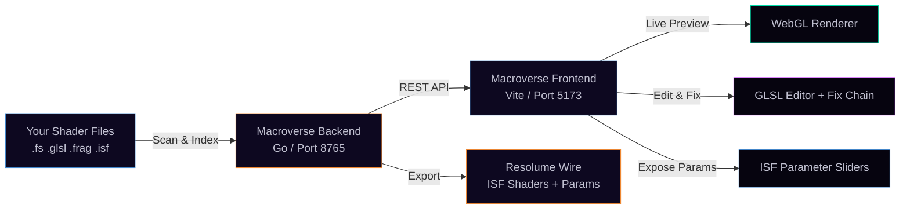

# Macroverse 42 — The Wired Atelier

> *Ride the signal. The wire is not a metaphor.*

A GLSL/ISF shader lab and VJ tool. Two ways in — one binary.

**[Try it live →](https://macroverse42.fly.dev/)** &nbsp;|&nbsp; **[Showcase →](https://aday1.github.io/Macroverse/)** &nbsp;|&nbsp; **[Download →](https://github.com/aday1/Macroverse/releases)**

---

## Two Ways In

### As a standalone VJ tool
Browse, preview, and perform with your entire GLSL/ISF shader collection. Tag, categorise, search. A/B deck with crossfader and mix modes. Stream MJPEG output to OBS, pipe through v4l2loopback as a virtual webcam on Linux. The whole library, live, under your hands.

### As a Resolume Wire pipeline
Load any GLSL/ISF file, check Wire compatibility, expose magic-number literals as parameter sliders, run the shader fix chain (broken glows → fixed in seconds), then push the finished shader straight into Resolume Wire. From raw `.fs` to a working Wire macro with exposed parameters and proper ISF metadata.

```
# Build from source (requires Go 1.21+, Node 20+)
./build.sh          # Linux / Mac
build.bat           # Windows
# then open http://localhost:8765
```

**Pre-built binaries for Windows, Linux, and Mac (amd64/arm64):** [Releases page](https://github.com/aday1/Macroverse/releases)

---

## What It Does



One Go binary. No Docker, no Node runtime, no external database. Drop it next to your shader folder and open `localhost:8765`.

---

## Expose Parameters

Turn raw GLSL literals into live ISF parameter sliders — the core feature for Wire integration.

- **Expose (instant)** — click Expose in the toolbar. Regex-based literal detection, zero tokens, zero latency.
- **AI Expose** — deeper analysis with Ollama or Cursor for complex shaders.
- Exposed parameters are written directly into the ISF JSON block and become controllable in Resolume Wire's universe.

```glsl
// Before: magic literals scattered through your shader
float speed = 2.5;
vec3 color = vec3(0.4, 0.8, 1.0);

// After: exposed as ISF sliders, controllable from Wire
// INPUTS: speed (float, 0.1–10.0), colorR/G/B (float, 0.0–1.0)
```

---

## Shader Fix Chain

When a shader fails to compile, fixes run in order — stop at the first success:

1. **Local regex fix** — free, instant. Handles precision qualifiers, missing semicolons, WebGL 1 incompatibilities, `#version` stripping.
2. **Ollama** — free local LLM. `ollama pull deepseek-coder-v2:16b` and configure in Settings.
3. **Cursor agent** — cloud tokens. Requires API key in Settings > LLM Provider Chain.

The chain is configurable: reorder, enable/disable each provider, select model per provider.

---

## VJ Scratchpad

A/B deck mixer for live performance. Access via the **VJ** tab.

- **Decks A and B** — load different shaders, tweak params independently
- **Crossfader** — smooth blend between decks
- **Mix modes** — Crossfade, Alpha Layer, Add, Multiply
- **Auto VJ** — automatic shader cycling with configurable timing
- **MIDI / OSC** — map physical controllers to any parameter
- **Pop-out output** — separate window for full-screen output on a second display

```
# MJPEG stream for OBS / browser source:
http://localhost:8765/api/output/macrocam/stream

# Linux virtual webcam:
ffmpeg -i http://localhost:8765/api/output/macrocam/stream -f v4l2 /dev/video0
```

---

## Gallery Mode

Browse your full shader collection as a live-rendered grid — every cell is a running WebGL shader. Access via the **Gallery** tab.

- **Navigate** with arrow keys (← → ↑ ↓); Alt+← / Alt+→ jump pages
- **Per-page** options: 1, 4, 8, 14, or 24 shaders — grid layout auto-adjusts
- **Tag shortcuts** — press **1–9** to toggle preset tags on the focused shader (same key removes the tag)
- **Set shortcuts** — press **Shift+1–9** to toggle preset VJ Sets
- **A** — set-toggle prompt showing all preset sets with current membership
- **F** — toggle favourite on the focused shader
- **R** — rename the focused shader
- **?** — floating shortcut HUD with all key bindings

**Preset VJ Sets** (9 named slots, Shift+1 through Shift+9):
`vj-ambient` · `vj-techno` · `vj-cosmic` · `vj-glitch` · `vj-geometric` · `vj-organic` · `vj-wire-ready` · `vj-dark` · `vj-colour`

**Seed VJ Sets** — one click auto-assigns shaders by name/format heuristics.

**Export ▾** — export any filtered view, set, or tag as CSV, JSON, or a plain path list (`.txt`, one path per line — feed directly into Resolume Avenue's batch loader).

---

## LLM Provider Chain

Configurable priority: **Local regex** → **Ollama** → **Cursor**

- Enable/disable each provider independently
- Reorder in Settings > LLM Provider Chain
- Ollama recommended: `ollama pull deepseek-coder-v2:16b`
- All providers optional — the tool works fully offline with just the local regex layer

---

## Wire Integration

- **Check ISF Wire** — validates the shader's ISF block for Wire compatibility
- **Clipboard to Wire** — sends the current shader and params to Wire's clipboard format
- **Expose** — surfaces literal values as ISF `INPUTS` (sliders, colours, booleans)
- **Refactor / Vibe** — AI-assisted code cleanup and structure improvements

Every ISF parameter has at minimum: `useFrameIndex`, `fps`, `timeScale`, `speed`. Most shaders also expose `mouseX/Y`, `colorR/G/B`, `brightness/saturation/contrast`.

---

## Development With Hot-Reload

```
# Terminal 1 — Go backend
cd api && go build -o ../Macroverse42 . && cd .. && ./Macroverse42

# Terminal 2 — Vite frontend (hot reload)
cd frontend && npm install && npx vite --host 0.0.0.0
# open http://localhost:5173
```

Vite proxies `/api` to the Go backend on port 8765. Always build then run; `go run .` won't find the shader assets.

---

## Cross-Platform

Runs on **Windows, Linux, and Mac** with the same binary. No PowerShell. No native file dialog. Browser-based path picker, text-based everywhere.

| Platform | Binary name |
|---|---|
| Windows | `Macroverse42.exe` |
| Linux / Mac | `Macroverse42` |

---

## Default Paths & Factory State

Everything lives **next to the binary** — no installation, no registry, no config scattered across the system.

| What | Default path |
|---|---|
| **Web UI** | `http://localhost:8765` |
| **Source paths** | `./shaders/` (folder next to the binary) |
| **Database** | `./macroverse.db` |
| **Settings** | `./shader-preview-settings.json` |
| **Error log** | `./shader-errors.json` |
| **Graveyard** | `./unrecoverable-shaders.json` |
| **Thumbnails** | `./thumbnails.json` |

All paths are relative to wherever you put the `Macroverse42` binary. Move the binary, move the folder — everything comes with it.

**Factory default settings** (restored on NUKE or first run):

| Setting | Default |
|---|---|
| Preview resolution | 854 × 480 |
| Target FPS | 30 |
| List view | List mode |
| Auto-fix pipeline | Enabled |
| Thumbnails | Enabled |
| Auto-optimize quality | Enabled |
| Git auto-commit | Disabled |
| MJPEG output | Disabled |
| Watch folders | Disabled |

**Source path fallback:** if `./shaders/` doesn't exist on first launch, the app looks for a `shaders/` folder next to the binary. You can add or remove source paths at any time in **Settings → Source Paths**.

**Override the database path** via environment variable: `SHADER_INDEX_DB=/path/to/macroverse.db`

### Hard Reset (git)

The **Hard Reset** button in Settings zips the configured target folder, then restores it from the earliest git commit on `main`. The target path defaults to `shaders/custom/` and is **configurable in Settings → Hard Reset Path** — set it to any folder tracked by a git repo.

It always creates a timestamped `.zip` backup before touching any files.

---

## UI Cheat Sheet

| Action | How |
|---|---|
| **Preview a shader** | Click it in the list |
| **Search** | Type in the filter box (name, tags, category) |
| **Rename** | Double-click the name, or right-click → Rename |
| **Move category** | Right-click → Move to category |
| **Add tags** | Click `+` next to tags, or right-click → Edit tags |
| **Expose parameters** | Click Expose in the code toolbar |
| **Send to Wire** | Click Clipboard to Wire after exposing |
| **Switch List/Grid** | List / Compact / Grid buttons |
| **Version history** | Right-click → See versions → click any to revert |
| **A/B VJ deck** | Click the VJ tab |
| **Gallery browse** | Click the Gallery tab |
| **Gallery navigate** | Arrow keys; Alt+←→ for pages |
| **Gallery tag** | 1–9 toggles preset tag on focused shader |
| **Gallery set** | Shift+1–9 toggles preset VJ Set |
| **Gallery shortcuts** | Press ? inside Gallery for full HUD |
| **Webcam input** | Right panel → Texture inputs → Webcam |
| **Full screen** | Click Full Screen in status bar, or F11 |

---

## Shader Library

| Category | Count | What's in it |
|---|---|---|
| 3d | 582 | Raymarched objects, scenes, spheres, cubes |
| color | 331 | Gradients, color cycling, hue effects |
| geometric | 284 | Circles, spirals, rings, patterns |
| misc | 218 | Everything else |
| grid | 189 | Checkerboards, tiles, voronoi, lattices |
| abstract | 175 | Organic flows, liquid, morphing |
| fractal | 122 | Mandelbrot, Julia, IFS fractals |
| noise | 92 | Perlin, simplex, FBM, distortion |
| tunnel | 90 | Infinite zoom, fly-through, depth |
| plasma | 88 | Fire, lava, plasma waves, heat |
| particles | 81 | Sparks, stars, dust, snow, rain |
| psychedelic | 62 | Kaleidoscope, acid, trippy, warp |
| space | 41 | Stars, galaxies, nebulae, planets |
| water | 25 | Ocean, ripples, caustics, pools |

All shaders are ISF format with exposed parameters.

---

## Screenshots

Add images to `docs/screenshots/` (`full-ui-layout.webp`, `context-menu.webp`, `grid-view.webp`, `emoji-picker.webp`) to display them in the README and on the [live showcase](https://aday1.github.io/Macroverse/).

---

## Tech Stack

| Layer | What |
|---|---|
| Backend | Go — single binary, no runtime dependencies |
| Frontend | Vite + TypeScript — vanilla DOM, no framework |
| Renderer | WebGL 1.0 with GLSL ES |
| Shader format | ISF (Interactive Shader Format) 2.0 |
| Database | SQLite via `modernc.org/sqlite` (pure Go, no CGO) |
| AI | Local regex → Ollama → Cursor priority chain |
| Target | Resolume Wire |
